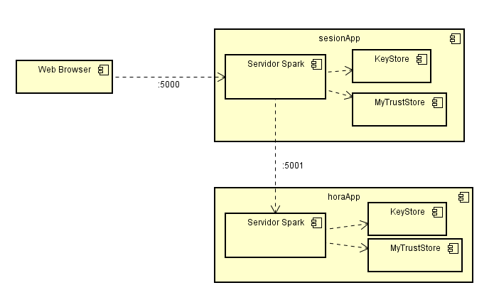
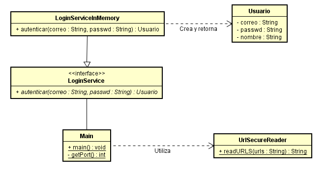
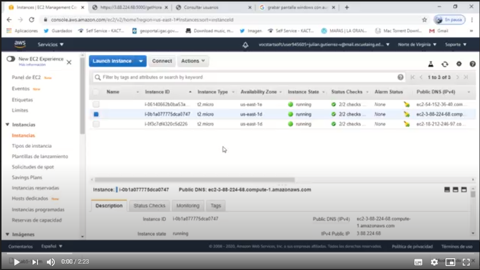

# Seguridad y Autenticación


## Despliegue en CircleCi

[](https://app.circleci.com/pipelines/github/JulianGutierritos/AREP-LAB6)

## Prerrequisitos ##

La persona que quiera utilizar este programa debe tener conocimientos básicos en Java y Maven.

Para compilar y ejecutar este programa se debe contar con las siguientes herramientas: 

- Java 8
- Maven 


## Herramientas utilizadas para el desarrollo ##

Para el desarrollo de este programa se utilizó: 

- Java: Fue el lenguaje de programación utilizado para el desarrollo.

- Spark: Librería de Java que se utilizó para montar nuestra API REST.

- Maven: Fue la herramienta utilizada para la gestión y construcción del programa.

- CircleCi: Fue la herramienta de integración continua utilizada.

## Descripción ## 

Este es un programa que fue diseñado con el único objetivo de ejemplificar cómo implementar la seguridad en aplicaciones web. Para esto, diseñamos 2 programas uno que se encarga de autenticar y mantener la sesión de un usuario (sesionApp) y otro que se encarga de darle una función básica a un usuario autenticado, en este caso, se trata de una función que retorna la hora del sistema.

La comunicación entre ambos subprogramas se realiza de manera segura mediante el protocolo HTTPS. 

A continuación, mostramos un breve modelo de la estructura de nuestro programa: 



De esta manera, gracias a nuestros "keyStore" y "myTrustStore" en cada subprograma, aseguramos una conexión segura entre los dos, así como desde el cliente al servidor de sesión.

Para la autenticación, creamos el subprograma "sesionApp". Este subprograma está compuesto de la siguiente manera:



Como podemos observar, el subprograma nos da flexibilidad en el modo de autenticar usuarios, gracias a su interfaz de "LoginService". También, para leer las páginas utilizando el protocolo https, el programa usa una clase llamada "URLSecureReader", esta clase se encarga de gestionar el "myTrustStore" para garantizar una lectura segura.

## Instrucciones para su compilación, ejecución y generación de documentación ##

Para compilar el programa, se debe primero ubicar en la carpeta del subprograma, ya sea el de sesionApp o horaApp, y allí ejecutar el siguiente comando:

```
   mvn package 
```

Una vez compilado el programa, lo siguiente es ejecutarlo. Para esto, debe ejecutar ambos subprogramas. Para ejecutar un subprograma, parese en la carpeta de este y ejecute el siguiente comando:

```
	java -cp target/classes:target/dependency/* edu.eci.arep.Main
```
(Para el correcto funcionamiento del programa, ¿es importante que se ejcuten los dos)

 
(**NOTA:** Si se encuentra en un computador con SO Windows, el comando a utilizar con ambos subprogramas es el siguiente:

```
	java -cp target/classes;target/dependency/* edu.eci.arep.Main
```

si utiliza el otro comando estando en Windows, el programa no funcionará). 

Cuando ya tenga en ejecución ambos subprogramas, ingrese a la siguiente url: 

```
	https://localhost:5000/index.html
```

Allí, puede iniciar sesión con los usuarios: 

- **correo:** prubastian@mail.com - **contraseña:** hola
- **correo:** prubastina@otromail.com - **contraseña:** adios
 

Si desea generar una nueva documentación del programa, debe ejecutar la siguiente lista de comandos ubicado en cada uno de los subprogramas:

```
   mvn javadoc:javadoc
   mvn javadoc:jar
   mvn javadoc:aggregate
   mvn javadoc:aggregate-jar
   mvn javadoc:test-javadoc
   mvn javadoc:test-jar
   mvn javadoc:test-aggregate
   mvn javadoc:test-aggregate-jar
```

Vale recalcar que los subprogramas ya cuentan con archivos de documentación ubicados en la carpeta "Documentacion" de cada uno.

## Desplegando en AWS ## 

**Vídeo de prueba**

[](https://youtu.be/0aPLbuNE5dQ)

```
https://youtu.be/0aPLbuNE5dQ
```

**Paso a paso para ejecutar en AWS**

Para desplegar este programa en AWS, utilizando una máquina distinta para cada subprograma, se deben seguir los siguientes pasos: 

- En la instancia que tendrá el programa "sesionApp", modificar el archivo "etc/hosts", asignándole un nombre de dominio a la IP de la máquina que tendrá el subprograma "horaApp". Por ejemplo, agregue la siguiente linea a ese archivo: 

```
   <Ip de la máquina "horaApp"> arepseguridad
```

- Luego, en el archivo "Main.java" del subprograma "sesionApp", cambie la linea: 

```
   String urls = "https://localhost:5001/getHora"
```

por: 

```
   String urls = "https://arepseguridad:5001/getHora"
```

- Después, cree de nuevo las llaves, junto con los certificados, pero para estas llaves utilice el nombre "arepseguridad" con contraseñas "123456".

- Posteriormente, copie los certificados de una de cada llave en la otra máquina (es decir, el certificado de "horaApp" en "sesionApp" y en el otro sentido), y luego, cree el "myTrustStore", en ambos lados, con contraseña "123456". 

- Finalmente, compile ambos programas y ejecutelos.


## Licencia ## 

La licencia de este proyecto es: [**GNU General Public License v3.0**](LICENSE)

## Autor ##

Julián David Gutiérrez Vanegas
